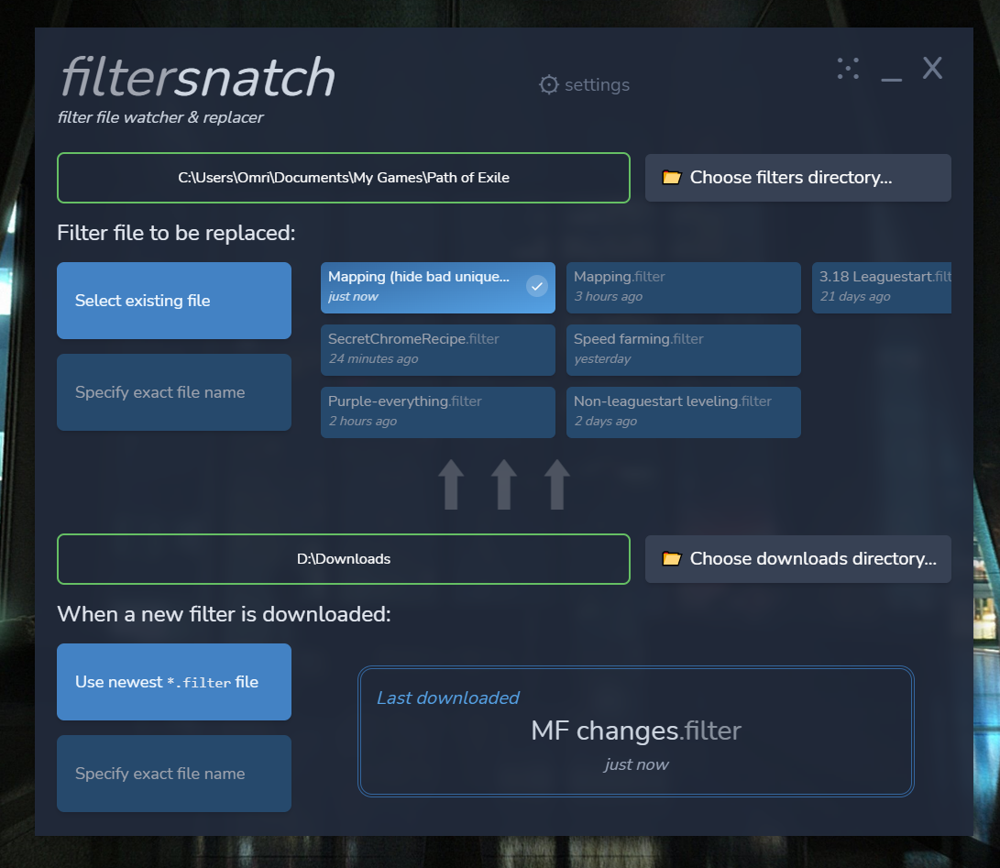

# filtersnatch

filtersnatch is an open-source **offline item filter watching & replacement tool** for Path of Exile.

**Join the [filtersnatch Discord server](https://discord.gg/MCFFXbUTzR) if you need help or have any questions!**

**[Download latest release](https://github.com/omriharel/filtersnatch/releases)** | **[Demo video](https://youtu.be/d0LYSMoFuYg)**

filtersnatch's goal is to save you the manual tinkering necessary to copy, replace and possibly rename a downloaded filter file (from a website like FilterBlade) between your browser's downloads directory to the Path of Exile item filters directory.

> Please note: filtersnatch is useful only if you're dealing with offline filters, meaning you download a `.filter` file and place it in the Path of Exile filters directory on your PC.
>
> **If you use the _online_ item filters on Path of Exile's website, you don't need this tool.**
>
> To be perfectly candid, nobody actually _needs_ this tool. I had some spare time on my hands lol

## Download and usage

To download the latest version, simply head over to the [Releases page](https://github.com/omriharel/filtersnatch/releases)!

filtersnatch runs as a tray application, except for the initial setup where you tell it where your filters are and choose how to overwrite them. It's distributed as a portable binary (no installer or auto-updates).

## Technical overview

filtersnatch is a Go program built on top of [Wails](https://github.com/wailsapp/wails), an incredible framework that allows to build desktop applications using web technologies such as React.

If you're interested in contributing or extending the project for yourself, please check out the [developer documentation](./scripts).

Here's a list of the main frameworks and packages used in this project:

- [Wails (v2)](https://github.com/wailsapp/wails) - Web-based desktop UI for Go applications
- [React](https://github.com/facebook/react) - Frontend framework
- [TailwindCSS](https://github.com/tailwindlabs/tailwindcss) - Styling and design (with [HeadlessUI](https://github.com/tailwindlabs/headlessui) for some components)
- [fsnotify](https://github.com/fsnotify/fsnotify) - File system notifications (for watching downloaded files)
- [systray](https://github.com/getlantern/systray) - System tray library for Go applications
- [viper](https://github.com/spf13/viper) - User configuration
- [xdg](github.com/adrg/xdg) - Default system directories

### Technical motivation

This is kind of overkill for the "problem" it "solves", but I wanted to try out Wails with a smaller-scale project because I've been considering it for a major future update to my main side-project, [deej](https://github.com/omriharel/deej).

Wails absolutely exceeded my expectations in terms of its ease-of-use, and I look forward to using it again in the future! React still bites me in the butt every time, but I'll get better at this eventually.
